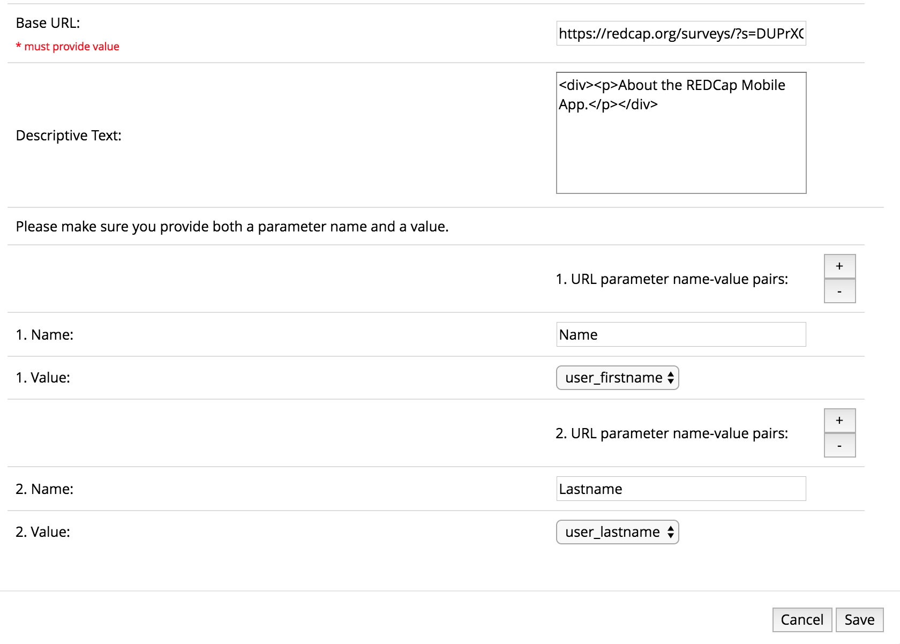

# REDCap module: Mobile Api Request to Survey

A REDCap module to route mobile api token requests in the **REDCap Mobile App** page to a survey. It also provides the option of adding descriptive text to the same page.

## Prerequisites
- REDCap >= 8.0.3 (for versions < 8.0.3, [REDCap Modules](https://github.com/vanderbilt/redcap-external-modules) is required).

## Installation
- Clone this repo into `<redcap-root>/modules/mobile_api_request_to_survey_v<version_number>`.
- Go to **Control Center > External Modules** and enable Mobile Api Request to Survey.
- Still in **Control Center > External Modules** configure the module with a URL and optionally, a descriptive text. You may also include parameter name-value pairs to be appended to the URL. Lastly, activate this module for all projects.

## Module Configuration
This module requires a Base URL to be provided as part of the system settings. The following values may be selected to be appended to the URL:

    user_firstname
    user_lastname
    email
    project_id
    USERID

The `USERID` field contains the redcap username.

To use the appended parameters, make sure the parameter names you chose coincide with the names of the fields in the target REDCap survey.

In addition, you may include an optional descriptive text, which may include html formatting. Such text will appear on the 'REDCap Mobile App' page before the title 'What is the REDCap Mobile App?'.

For example, using the configuration below:

the rewritten target URL might look like this:

    https://redcap.org/surveys/?s=DUPrXGmx3L&Name=jdoe&Lastname=doe_lastname

and the text 'About the REDCap Mobile App' will be added on the 'REDCap Mobile App' before the title 'What is the REDCap Mobile App?'.

## Module Workflow
1. The user requests a token: On the project in question, the user clicks on the left menu link **REDCap Mobile App** and then on the button **Request API token**. He is redirected to the URL provided during the configuration of the module. Once he completes the questionnaire, the token request will be submitted.
2. The project manager/administrator receives the request.
3. The project manager/administrator approves the request.
4. The project manager/administrator disables the module: The project manager/administrator disables the module in the project by going to the ** External Modules** page (under Applications) and clicking **Disable** next to the **Route Mobile Api Token Requests to Survey** module.
5. The user goes back to the project in question and clicks the **Request API token** button on the **REDCap Mobile App** page.
6. The project manager/administrator receives the Mobile App API token request and approves the request.
Note: you can tell a project has been approved for the Mobile App because the user(s) no longer have to complete the Mobile App Request Survey – because the external module is now disabled in the project, other users can directly request a Mobile App API token via the REDCap Mobile App page in the project.
